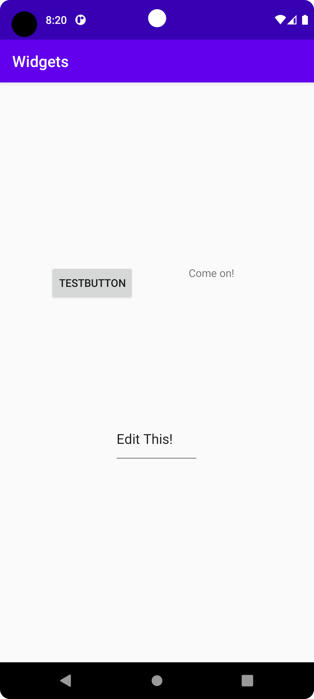

# Rapport

Forked the project on github.
Used ConstraintLayout.
Added three new widgets to the activity_main.xml

1. TextView 
2. EditText
3. Button

Set the layout to match parent.
Used the Design-view to change the positions of the widgets.


Example;
Below code adds an EditText-widget which can be clicked on to edit its text.
The default text is ''Edit this!'', size is the layout_width/height. 
```
 <EditText
        android:layout_width="112dp"
        android:layout_height="67dp"
        android:text="Edit This!"
        app:layout_constraintBottom_toBottomOf="parent"
        app:layout_constraintHorizontal_bias="0.498"
        app:layout_constraintLeft_toLeftOf="parent"
        app:layout_constraintRight_toRightOf="parent"
        app:layout_constraintTop_toTopOf="parent"
        app:layout_constraintVertical_bias="0.626" />
```



